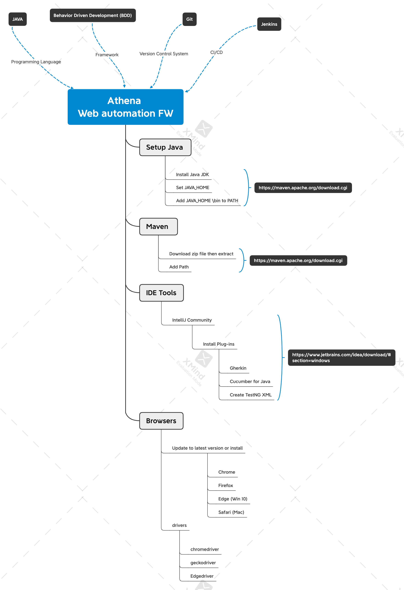
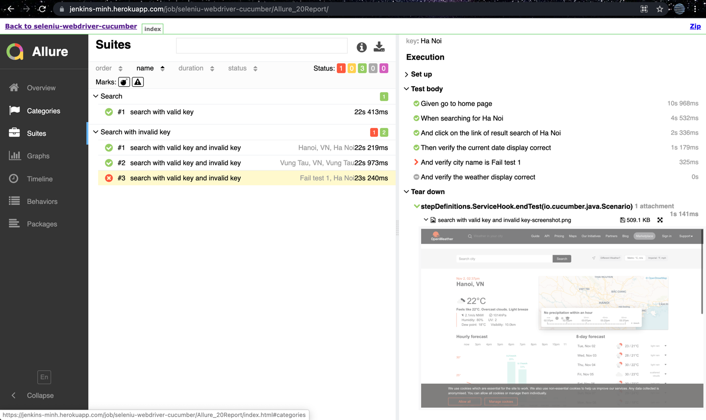

# Welcome to Athena Web Automation Project

This maven project consists of following technologies/frameworks:
- Selenium
- Cucumber
- TestNG
- Allure

This combination allows you to easily write UI tests in Java.
Besides, to apply Page Object Model to design pattern.


## Setup


## UI Tests modules
Currently, there are following modules available (use them for tests of specific area and feel free to add new):
* core - includes all core module project (abstract, enum, util and constant)
* pages - includes all page object which implement web elements and actions
* stepDefinitions - define and implement all steps
* TestRunners - implement flow to run test

## Prefix of Element name
```
  /***************************
     * btn -> button
     * chk -> checkbox
     * dtp -> date picker
     * img -> image
     * lbl -> label
     * lst -> list box
     * mnu -> Menu
     * msg -> messages
     * rad -> radio button
     * tab -> tab
     * txt -> input form
     * tbl -> table
     * drpdwn -> dropdown
     ***************************/
```
Ex: The located element is input field, so the element name should be started with prefix txt.

## Build
### Local build
Build can be triggered from any athena-web-automation folder with the following command

```
mvn clean install
```
Or you can run all tests together from parent project.

### Running single test
Specify test you want to run by test parameter.

-Dbrowser=chrome/firefox (default: chrome)

-Dtest=TestSerialRunner (default: null means run all tests)

-DisHeadless=true (default: false)

-Dcucumber.filter.tags=@Test-1 && @Test-2 || @Test-3

-Dtimeout=15 (default: 10, unit: second)

-DpageLoadTimeout=10 (default: 5, unit: second)

```
mvn clean test allure:report -DisHeadless=true
```
Please note test suite name needs to be suffixed by Test not Tests. Otherwise it's not possible to run it separately.

### Debugging
Run test with Surefire plugin debug option.
Test execution should wait for attaching debugger to 5005 port. See example configuration of maven-debug inside IntelliJ IDEA.

## CI/CD
A maven project to run test is built on jenkins and is deployed to [jenkins-minh.herokuapp](https://jenkins-minh.herokuapp.com/job/seleniu-webdriver-cucumber/)

Warning: 
* login by user: admin and password: 721673bf483a4f63ac5e26beba7c8484
* job: https://jenkins-minh.herokuapp.com/job/seleniu-webdriver-cucumber/
* Please just view config for checking solution, DON'T TRIGGER job because it is deployed on free domain with limit memory.
It will be terminated immediately. 

By the way, we can build locally jenkins with [heroku-jenkins repository](https://github.com/mluu3/herkou-jenkins/tree/develop) 

## Report
### Cucumber - TestNG
Cucumber-TestNG report will be generated pretty html in ``target/cucumber-reports``, base on parse the JSON file.

### Allure - Cucumber JVM

Then execute ``mvn clean test allure:report`` goal. After tests executed allure JSON files will be placed in ``target/allure-results`` directory by default.
Report will be generated tо directory: ``target/allure-report/index.html``
[click here to see a report](https://jenkins-minh.herokuapp.com/job/seleniu-webdriver-cucumber/Allure_20Report/)

Warning:
* login by user: admin and password: 721673bf483a4f63ac5e26beba7c8484
* DON'T TRIGGER job.

    
Or, to generate a report from test result ``target/allure-result/``using one of the following command:
```
mvn allure:serve
```
Report will be generated into temp folder. Web server with results will start.

Additional information can be found [here](https://docs.qameta.io/allure/#_cucumber_jvm).
## Git workflow
This repository is switched to the standard gitflow model (as you are used to on other component repositories).

Summary:
* happy path: open PR to `develop` branch (for new features/tests or bugfixes related to `develop` stage)
* open PR to `master` branch in case of hot fixing tests on production
* following merge from the `master` to `develop` should be done (auto-merging is missing at the time of writing)
* merge of `develop` branch to `master` happens automatically before the production release
